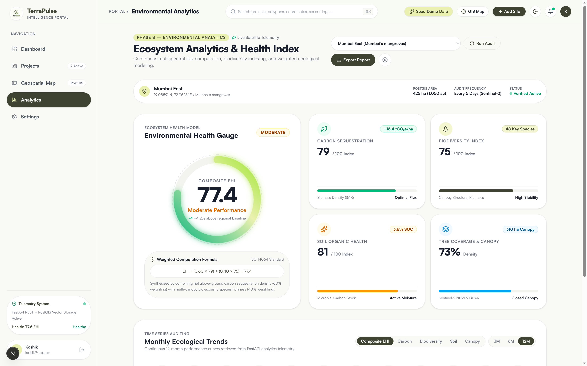
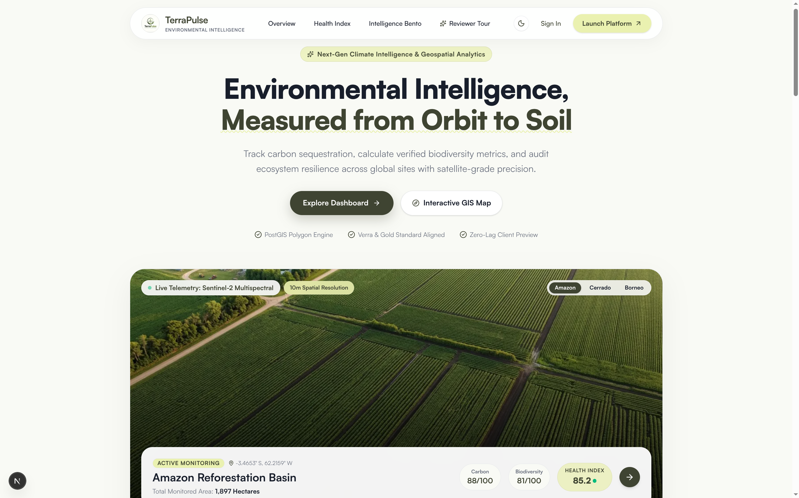
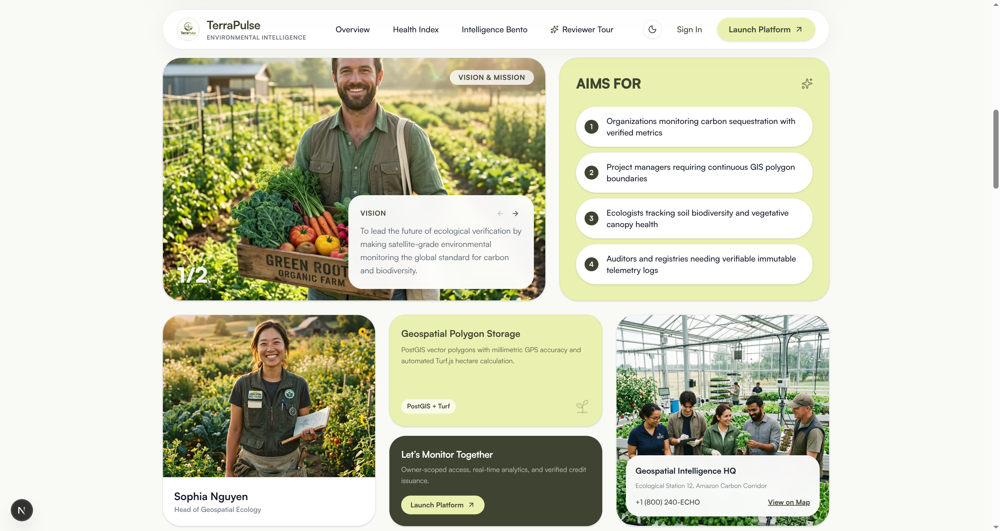
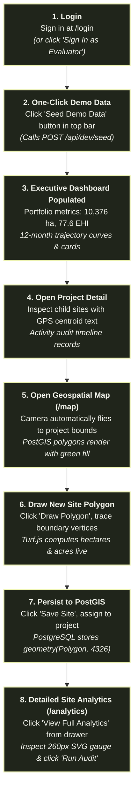
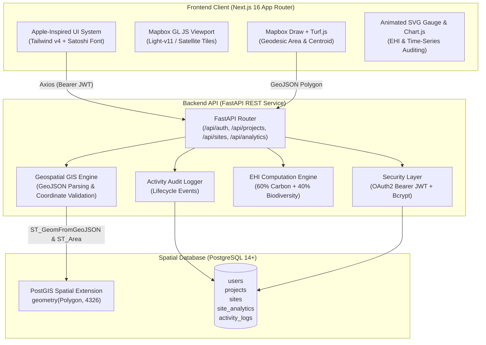
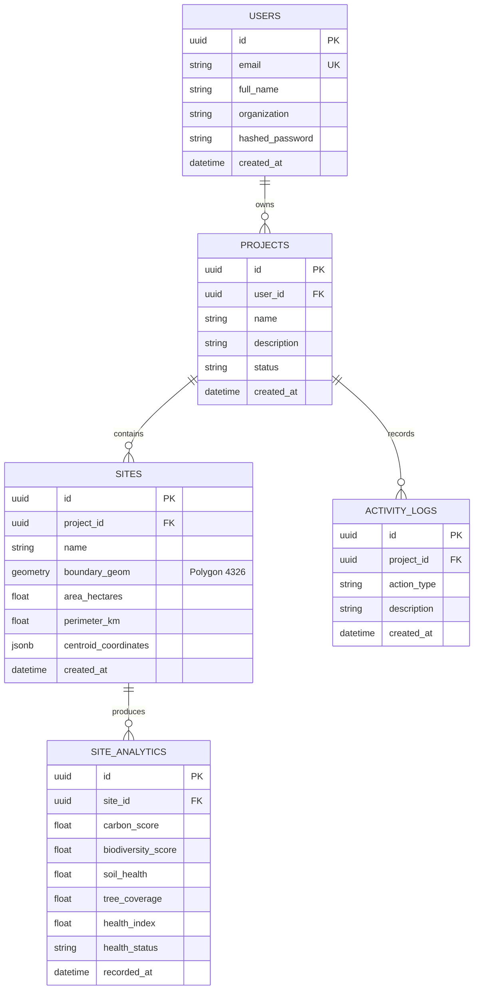

# 🌍 TerraPulse — Environmental Intelligence Platform

[](https://terrapulse-one.vercel.app/)
[](https://terrapulse-gibu.onrender.com/docs)
[](https://github.com/KBM2795/terrapulse)
[](frontend)
[](backend)
[](backend)
[](frontend)
[](.github)

> **TerraPulse** is an enterprise-grade ecological asset monitoring and environmental intelligence platform. Designed for carbon offset developers, biodiversity registries, and land managers, it pairs real-time PostGIS polygon boundary ingestion with geodesic Turf.js area calculations, an automated Environmental Health Index (EHI) scoring engine, and an Apple-inspired visual aesthetic.

---

## 🌐 Live Demo & Repository Links

| Resource | URL | Details / Visibility |
| :--- | :--- | :--- |
| **Frontend Web App** | [https://terrapulse-one.vercel.app/](https://terrapulse-one.vercel.app/) | `Live on Vercel` |
| **Backend REST API** | [https://terrapulse-gibu.onrender.com/](https://terrapulse-gibu.onrender.com/) | `Live on Render` |
| **Interactive API Docs** | [https://terrapulse-gibu.onrender.com/docs](https://terrapulse-gibu.onrender.com/docs) | `Swagger UI` |
| **GitHub Repository** | [https://github.com/KBM2795/terrapulse](https://github.com/KBM2795/terrapulse) | `Public` |

---

## 📸 Platform Highlights

### Executive Portal Dashboard
Comprehensive ecological monitoring overview with composite Environmental Health Index, active acreage, 12-month performance curves, and quick action bar.


### Interactive Geospatial GIS Viewport (`/map`)
Precision boundary mapping with Mapbox Draw, real-time client-side Turf.js area calculation, smart camera autofocus, and slide-over telemetry drawer.


### Ecosystem Analytics & Health Index (`/analytics`)
Dynamic 260px SVG circular Environmental Health Gauge with ISO 14064 formula breakdown, 4 core multispectral sensor metrics, and compliance audit export.


### Public Landing Experience & Architecture
Next-generation environmental intelligence landing page with zero-lag client preview, interactive carousel, and stakeholder capabilities bento grid.



---

## 🚀 Reviewer Demo Journey (Fast-Path Flow)

Follow this rapid 2-minute walkthrough to test all 10 core hackathon differentiators:



---

## ⚡ The 10 Core Hackathon Differentiators

| # | Differentiator | Implementation Details |
| :---: | :--- | :--- |
| **1** | **Environmental Health Index (EHI)** ⭐ | Replaces isolated carbon/biodiversity numbers with an automated composite scoring formula: <br/>$$\text{EHI} = (0.60 \times \text{Carbon}) + (0.40 \times \text{Biodiversity})$$<br/>Rendered via a custom 260px SVG circular gauge with radial glow. |
| **2** | **Native PostGIS Spatial Engine** ⭐ | Ingests GeoJSON polygons into PostgreSQL `geometry(Polygon, 4326)` with native server-side geodesic area calculations (`ST_Area(geom::geography) / 10000`). |
| **3** | **Client Geodesic Geometry (Turf.js)** ⭐ | Computes millimetric surface area, perimeters, centroids, and bounding boxes directly in the browser during polygon drawing. |
| **4** | **Interactive Camera Autofocus** ⭐ | Smart camera transitions that fly directly to targeted sites or project bounding boxes with dynamic right-side padding offsets (`right: 400px`) so polygons are never hidden under the slide-over drawer. |
| **5** | **Immutable Activity Audit Timeline** ⭐ | Real audit logging system tracking `PROJECT_CREATED`, `SITE_ADDED`, `ANALYTICS_GENERATED`, and `SITE_DELETED` events across projects. |
| **6** | **One-Click Evaluator Seed** ⭐ | Fast-path endpoint (`POST /api/dev/seed`) and UI button provisioning sample projects across global biomes (Amazon, Mumbai Mangroves, Black Forest, Sundarbans) with 12 months of telemetry history. |
| **7** | **Apple-Inspired Design System** ⭐ | Natural Earth Dark Theme (`#161A12` canvas, `#20251B` cards, `#2E3626` borders, `#EBF1B1` lime glow) and Cream Light Theme (`#F9FAF5`) with custom Satoshi typography and frosted glass capsules. |
| **8** | **Time-Series Sensor Auditing** ⭐ | 12-month historical telemetry tracking Carbon Sequestration, Biodiversity Species Count, Soil Organic Carbon (SOC), and Vegetative Canopy density with 3M/6M/12M range toggles. |
| **9** | **Full CI/CD & Code Quality** ⭐ | Automated GitHub Actions workflows for both frontend and backend verifying formatting (Prettier), type safety (`tsc`), linting (`eslint`, `flake8`), and production Next.js builds. |
| **10** | **Enterprise Multi-Project Scoping** ⭐ | User-scoped portfolio architecture with cascade deletion, live system health monitoring (`/api/health`), and custom Mapbox token management. |

---

## 🏗️ System Architecture



---

## 🗄️ Database Schema (Entity Relationship Diagram)



---

## 📁 Repository Structure

```
terrapulse/
├── frontend/                     # Next.js 16 Frontend Application
│   ├── app/                      # Next.js App Router
│   │   ├── (app)/                # Authenticated Portal Routes
│   │   │   ├── dashboard/        # Executive Dashboard
│   │   │   ├── map/              # Geospatial Intelligence GIS Map
│   │   │   ├── analytics/        # Ecosystem Analytics & EHI Gauge
│   │   │   ├── projects/         # Projects & Project Detail [id]
│   │   │   └── settings/         # User Profile & System Health
│   │   ├── login/                # Authentication Pages
│   │   ├── register/
│   │   └── page.tsx              # Public Landing Experience
│   ├── components/               # UI Design System & Bento Components
│   ├── lib/                      # API, Auth, Map, Projects Services
│   ├── public/screenshots/       # High-Resolution Platform Screenshots
│   ├── .husky/                   # Pre-commit git hooks (lint-staged)
│   └── .github/workflows/        # Frontend CI (Lint, Typecheck, Build)
│
├── backend/                      # FastAPI Python Backend
│   ├── app/
│   │   ├── auth/                 # JWT & Bcrypt Authentication
│   │   ├── database/             # PostgreSQL Session & Engine
│   │   ├── models/               # SQLAlchemy 2.0 & PostGIS Models
│   │   ├── routes/               # REST API Endpoints
│   │   ├── schemas/              # Pydantic v2 Input/Output Schemas
│   │   └── services/             # Spatial & Telemetry Business Logic
│   ├── docs/screenshots/         # Mirrored Platform Screenshots
│   └── .github/workflows/        # Backend CI (Flake8 & Startup Check)
│
└── README.md                     # Root Documentation & Master Guide
```

---

## 🚀 Quickstart Guide

### 1. Start the Backend API
```bash
cd backend
python3 -m venv venv
source venv/bin/activate
pip install -r requirements.txt

# Start FastAPI server
uvicorn app.main:app --host 0.0.0.0 --port 8000 --reload
```
*Swagger API Docs: [http://localhost:8000/docs](http://localhost:8000/docs)*

### 2. Start the Frontend App
```bash
cd frontend
npm install

# Start Next.js development server
npm run dev
```
*Frontend Portal: [http://localhost:3000](http://localhost:3000)*

---

## 🔐 Evaluator Login Credentials

| Role | Email | Password |
| :--- | :--- | :--- |
| **Lead Auditor / Evaluator** | `alex.chen@terrapulse.io` | `Password123!` |
| **Alternative Evaluator** | `koshik@test.com` | `Password123!` |

*(Click **"Seed Demo Data"** on the top navigation bar at any time to reset and provision fresh test data).*
