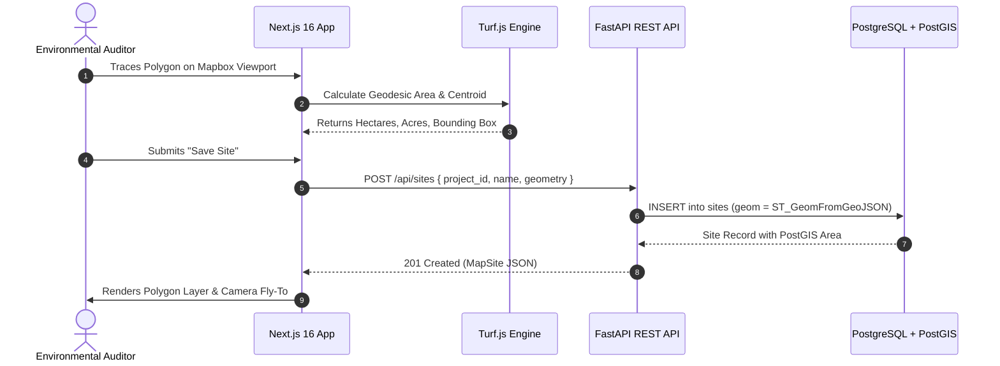

# TerraPulse Frontend — Next-Gen Geospatial Environmental Intelligence Platform

[](https://nextjs.org/)
[](https://react.dev/)
[](https://docs.mapbox.com/mapbox-gl-js/)
[](https://turfjs.org/)
[](https://tailwindcss.com/)
[](.github/workflows/ci.yml)

> **TerraPulse** is a satellite-grade environmental intelligence platform designed for ecological asset managers, carbon project auditors, and biodiversity registries. Built with an Apple-inspired dark/light aesthetic, real-time PostGIS spatial mapping, client-side Turf.js geodesic geometry computation, and multi-sensor environmental telemetry.

---

## 📸 Platform Screenshots

### 1. Executive Portal Dashboard

Real-time portfolio overview, composite Environmental Health Index (EHI), 12-month trajectory curves, and quick action bar.


### 2. Interactive Geospatial Intelligence Map (`/map`)

Precision polygon boundary tracing with Mapbox Draw, real-time Turf.js geodesic area & perimeter calculation, camera autofocus, and slide-over telemetry drawer.


### 3. Ecosystem Analytics & Health Index (`/analytics`)

Dynamic 260px SVG Environmental Health Gauge with ISO 14064 weighted formula, 4 core telemetry cards, multispectral time-series auditing, and one-click report export.


### 4. Landing Page Hero & Interactive Preview

Public landing experience featuring Apple-inspired aesthetics, zero-lag client preview, and interactive carousel.


### 5. Ecological Vision & Bento Grid Architecture

Mission manifesto, stakeholder personas, and technical capabilities bento presentation.


---

## 🎯 Reviewer Demo Journey (Fast-Path Flow)

Follow this 2-minute walkthrough to experience all core platform differentiators:

```mermaid
flowchart LR
    A["1. Login<br/><b>Sign in with demo credentials</b>"] --> B["2. Seed Demo Data<br/><b>Click 'Seed Demo Data' button</b>"]
    B --> C["3. Dashboard Populated<br/><b>Live EHI, total ha & trends</b>"]
    C --> D["4. Open Projects<br/><b>Inspect sites & activity timeline</b>"]
    D --> E["5. Open GIS Map<br/><b>Camera flies to project bounds</b>"]
    E --> F["6. Draw Polygon<br/><b>Trace vertices, calculate ha via Turf.js</b>"]
    F --> G["7. Save to PostGIS<br/><b>Site saved & telemetry computed</b>"]
    G --> H["8. View Analytics<br/><b>Audit report & circular EHI gauge</b>"]

    classDef step fill:#20251B,stroke:#EBF1B1,stroke-width:2px,color:#F3F5EC;
    class A,B,C,D,E,F,G,H step;
```



1. **Sign In**: Navigate to `/login` using the demo credentials below (or click **"Sign In as Evaluator"**).
2. **Generate Demo Data**: Click **"Seed Demo Data"** in the top navigation bar or settings. This calls `POST /api/dev/seed` to populate verified projects, PostGIS polygon sites, and 12-month telemetry histories.
3. **Inspect Dashboard**: View the portfolio metrics: **10,376 ha** monitored, composite **77.6 EHI**, and monthly performance curves.
4. **Browse Projects (`/projects`)**: Open any project to view child sites with GPS coordinates, total area, and the immutable activity audit log.
5. **Interactive GIS Map (`/map`)**:
   - Click **"Go to Map"** on any project to automatically zoom and fit camera bounds to its polygons.
   - Click **"Draw Polygon"** to trace a boundary on the map.
   - Watch Turf.js calculate area in hectares in real-time.
   - Click **"Save Site"** to persist the GeoJSON polygon into PostgreSQL via PostGIS.
6. **Detailed Analytics (`/analytics`)**:
   - Click **"View Full Analytics"** from the map drawer.
   - Inspect the large circular **Environmental Health Gauge (77.4 EHI)**.
   - Toggle metric tabs (_Carbon Flux_, _Biodiversity_, _Soil Organic Health_, _Tree Canopy_) across 3M, 6M, and 12M historical ranges.
   - Click **"Run Audit"** to compute real-time multispectral sensor telemetry.

---

## ⚡ Core Technical Differentiators

| Feature                                 | Description                                                                                        | Technical Implementation                                                                                                     |
| :-------------------------------------- | :------------------------------------------------------------------------------------------------- | :--------------------------------------------------------------------------------------------------------------------------- |
| **Environmental Health Index (EHI)** ⭐ | Composite ecological scoring formula integrating carbon sequestration and biodiversity richness.   | Formula: `(0.60 × Carbon) + (0.40 × Biodiversity)`. Rendered via dynamic SVG circular gauge with radial gradients.           |
| **Real PostGIS Integration** ⭐         | Spatial geometry storage with native bounding box calculations and GIS coordinate transformations. | Stores polygons as PostGIS `geometry(Polygon, 4326)` with automated geodesic area via `ST_Area(geog) / 10000`.               |
| **Client Geodesic Computation** ⭐      | Real-time vertex calculation directly in the browser during polygon drawing.                       | Turf.js geodesic algorithms (`@turf/area`, `@turf/bbox`, `@turf/center`) with instant hectare and acre conversion.           |
| **Interactive Camera Autofocus** ⭐     | Smart camera transitions that fly directly to targeted sites or project bounding boxes.            | Mapbox GL `fitBounds` with dynamic right-side padding offset (`right: 400px`) so polygons are never hidden under the drawer. |
| **Activity Audit Trail** ⭐             | Enterprise audit logging tracking all administrative and analytical lifecycle events.              | Logs `PROJECT_CREATED`, `SITE_ADDED`, `ANALYTICS_GENERATED`, and `SITE_DELETED` with chronological timestamps.               |
| **One-Click Demo Seed** ⭐              | Fast-path evaluator provisioning generating full sample portfolios and telemetry history.          | One-click trigger in top navbar and settings invoking `POST /api/dev/seed`.                                                  |

---

## 🛠️ Tech Stack

- **Framework**: [Next.js 16.3.5](https://nextjs.org/) (App Router, Turbopack, React 19)
- **Geospatial & Mapping**: [Mapbox GL JS](https://docs.mapbox.com/mapbox-gl-js/) + [@mapbox/mapbox-gl-draw](https://github.com/mapbox/mapbox-gl-draw) + [@turf/turf](https://turfjs.org/)
- **Styling & Design System**: [Tailwind CSS v4](https://tailwindcss.com/) + Custom Natural Earth Dark/Light palette (`#161A12`, `#20251B`, `#EBF1B1`)
- **Data Visualization**: [Chart.js](https://www.chartjs.org/) + [react-chartjs-2](https://react-chartjs-2.js.org/) + Custom SVG Animated Gauges
- **Icons**: [Lucide React](https://lucide.dev/) + HugeIcons
- **State & Networking**: Axios with interceptors, JWT decode, Cookies
- **CI / Git Hooks**: GitHub Actions + Husky 9 + Lint-Staged + ESLint 9 + Prettier

---

## 🏗️ Architecture & System Flow



---

## 🚀 Setup & Local Installation

### Prerequisites

- **Node.js**: v20.x or higher
- **npm**: v10.x or higher
- **Backend API**: Running at `http://localhost:8000` (see Backend README)

### 1. Clone & Install

```bash
cd frontend
npm install
```

### 2. Environment Configuration

Create a `.env` file in the `frontend` root:

```env
# Backend API Base URL
NEXT_PUBLIC_API_URL=http://localhost:8000

# Optional: Mapbox Access Token (for vector light-v11 style)
# If omitted, built-in CartoDB Light & Esri Satellite raster tiles will load automatically
NEXT_PUBLIC_MAPBOX_TOKEN=pk.eyJ1IjoieW91cnVzZXJuYW1lIiwiYSI6ImNsc...
```

### 3. Run Development Server

```bash
npm run dev
```

Open [http://localhost:3000](http://localhost:3000) in your browser.

---

## 🧪 Testing & Code Quality

```bash
# Run ESLint (0 errors, 0 warnings enforced)
npm run lint

# TypeScript Typecheck (strict noEmit)
npm run typecheck

# Code Formatting Verification (Prettier)
npm run format:check

# Production Next.js Build
npm run build
```

---

## 🔐 Demo Credentials

| Role                         | Email                     | Password       |
| :--------------------------- | :------------------------ | :------------- |
| **Lead Auditor / Evaluator** | `alex.chen@terrapulse.io` | `Password123!` |
| **Alternative Account**      | `koshik@test.com`         | `Password123!` |

_(You can also use the **"Seed Demo Data"** button on the top navigation bar to reset and provision demo data at any time)._

---

## 🔮 Future Scope

- **Sentinel-2 Multispectral Ingestion**: Direct automated STAC API ingestion from Copernicus Open Access Hub.
- **Drone Orthomosaic Uploads**: Client-side GeoTIFF tiling via Web Workers and Cloud-Optimized GeoTIFFs (COG).
- **Carbon Credit Tokenization**: Verra-standard certificate hashing onto EVM-compatible zero-knowledge chains.
